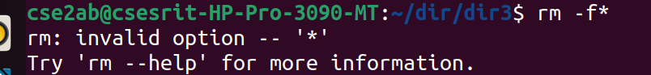
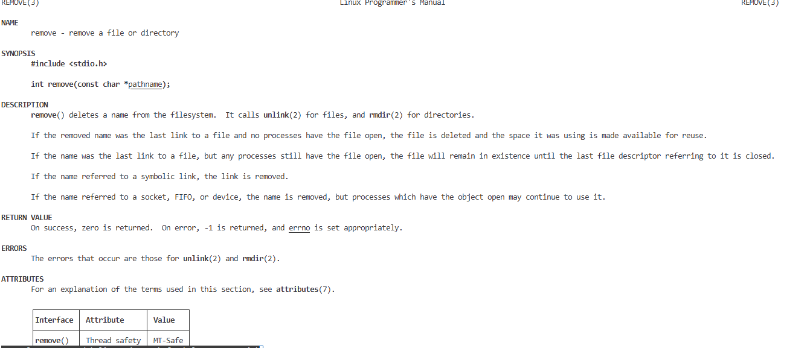

# OS-LAB
Operating System Lab
#basic linux practice
General command outputs
# date command output

# pwd command output

# echo command output

# who command output

# tty command output

# uname command output

# bc command output

# history command output

# mkdir command output

# cat command output

# cp command output

# ls command output

# rmdir command output

# move command output

# touch command output

# rms command output

# cal command output

# cmp command output

# remove command output

