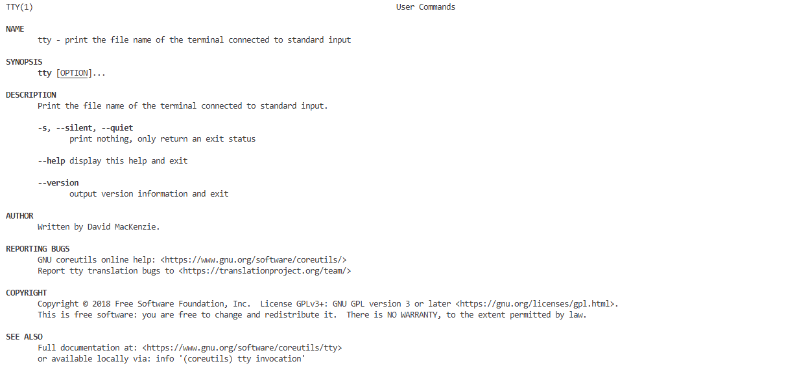
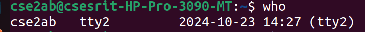

# OS-LAB
Operating System Lab
#basic linux practice
General command outputs
### bc command ouput

### cal command ouput

### calyear command ouput

### cat command ouput

### cd command ouput

### chmod command ouput

### cmp command ouput

### cp command ouput

### date command ouput

### echo command ouput

### exit command ouput

### history command ouput

### ls command ouput

### mkdir command ouput

### move command ouput

### pwd command ouput

### rmdir command ouput

### rms command ouput

### touch command ouput

### tty command ouput

### uname command ouput

### who command ouput

