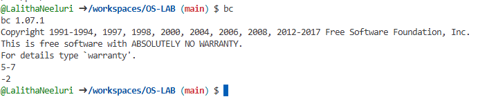
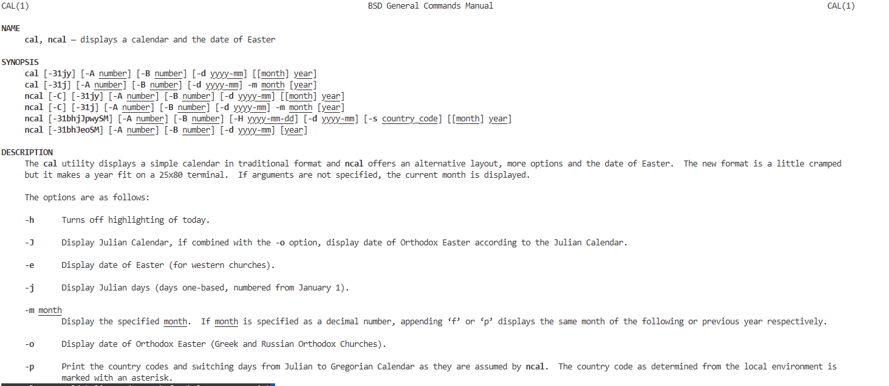
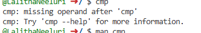
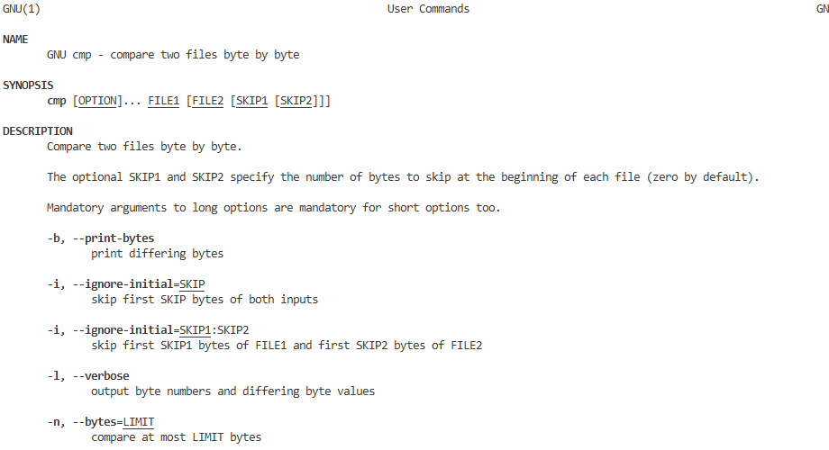

# OS-LAB
Operating System Lab
#basic linux practice
General command outputs
### bc command ouput

### cal command ouput

### calyear command ouput

### cat command ouput

### cd command ouput

### chmod command ouput

### cmp command ouput

### cp command ouput

### date command ouput

